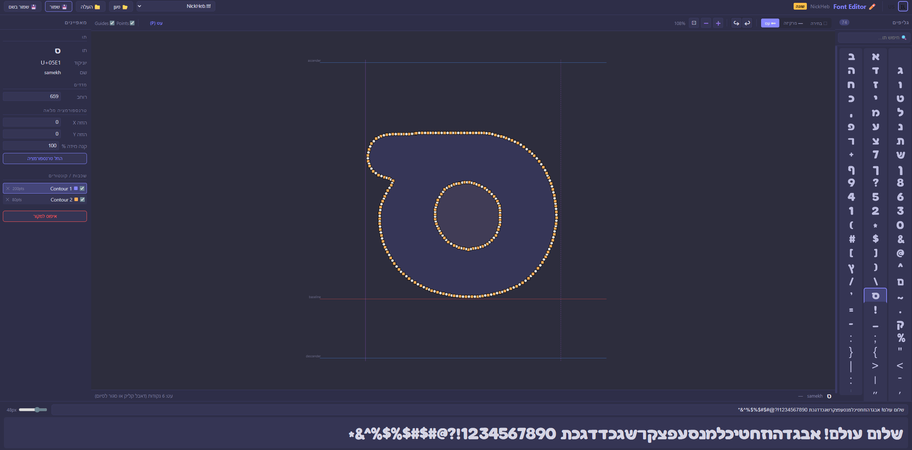

<div dir="rtl">

# 🔤 Image to Hebrew Font + ✏️ Font Editor

**סט כלים מלא ליצירה ועריכה של פונטים עבריים**

🌐 **[אתר הפרויקט](https://uberstorm.github.io/Image-To-Hebrew-Font-Generator/)**

שני כלים משלימים:
1. **Font Generator** — יוצר פונט TTF מתמונת AI: זיהוי אוטומטי של אותיות, שיוך, כוונון ויצירת קובץ TTF
2. **Font Editor** — עורך ויזואלי לקבצי TTF: עריכת נקודות, ציור קונטורים, עיגול פינות ותצוגה מקדימה חיה

---

## 🚀 התקנה והפעלה

### דרישות מוקדמות
- Python 3.8 ומעלה
- Windows (נבדק על Windows 10/11)

### התקנה

```bash
# 1. שכפול הריפו
git clone https://github.com/UberStorm/Image-To-Hebrew-Font-Generator.git
cd Image-To-Hebrew-Font-Generator

# 2. התקנה (יוצר venv אוטומטית ומתקין חבילות)
install.bat
```

### הפעלה

```bash
# יוצר פונטים מתמונה — נפתח ב-http://127.0.0.1:5000
run.bat

# עורך פונטים ויזואלי — נפתח ב-http://127.0.0.1:5001
run_fonteditor.bat
```

ניתן להריץ את שניהם במקביל.

---

## 🔤 Font Generator — יצירת פונט מתמונה

### 📸 צילומי מסך

<div dir="ltr" align="center">

| העלאת תמונה וזיהוי | שיוך אותיות וכוונון | תצוגה מקדימה ויצירת פונט |
|:---:|:---:|:---:|
|  |  |  |

</div>

### ✨ תכונות

#### זיהוי וסקירה
- **זיהוי אוטומטי של אותיות** — מעלים תמונה והמערכת מזהה את כל הצורות בנפרד
- **רמת הפרדה מתכוונת (0–5)** — בקרה על עוצמת ההפרדה בין אותיות צפופות
- **סקירת זיהויים ויזואלית** — תצוגת Canvas עם מלבנים; גרירה להוספת זיהוי חסר, לחיצה למחיקה
- **זיהוי מחדש** — כפתור re-detect עם שליטה על רמת ההפרדה ישירות מהסקירה

#### שיוך אותיות
- **שיוך במקלדת** — לחיצה על כרטיס + הקלדת אות = שיוך מיידי עם מעבר אוטומטי
- **מיזוג ופיצול** — מיזוג צורות שזוהו בנפרד (כמו נקודה + גוף של ! או ?) ופיצול צורות מורכבות

#### תצוגה מקדימה וכוונון
- **תצוגה מקדימה חיה** — הקלדת טקסט ותצוגה מיידית של איך הפונט ייראה
- **כוונון לכל אות** — גודל (Scale), הזזה אנכית/אופקית, ריווח (Spacing)
- **כוונון גלובלי** — החלת הגדרות על כל האותיות בלחיצה אחת
- **גדלים פרופורציונליים** — אותיות קטנות נשארות קטנות יחסית לגדולות, כמו בפונט אמיתי

#### יצירת פונט
- **עקומות Bézier חלקות** — עקומות קוואדרטיות לתוצאה מקצועית
- **תמיכה בחורים** — אותיות כמו ב, ד, ה, ם, ס שומרות על החללים הפנימיים
- **אותיות סופיות עם descenders** — ך, ן, ף, ץ, ק — ירידה אוטומטית מתחת לקו הבסיס
- **תווים נפוצים מ-Arial** — ~46 תווים (ספרות, פיסוק, סוגריים) מוזרקים אוטומטית
- **מטא-דאטה** — שם יוצר, תיאור, גרסה, רישיון, אתר (אופציונלי)

#### שמירה וטעינת פרויקט
- **ייצוא/ייבוא פרויקט (.hfm)** — שמירת כל מצב העבודה לקובץ עצמאי: תמונה, זיהויים, שיוכים, כוונונים, מטא-דאטה

### 📖 שלבי עבודה

| שלב | תיאור |
|---|---|
| **1 — העלאת תמונה** | העלאת תמונה עם אותיות (או טעינת פרויקט .hfm). כוונון רמת הפרדה (0–5) |
| **2א — סקירת זיהויים** | מלבנים צבעוניים על כל צורה. גרירה להוספה, לחיצה למחיקה, זיהוי מחדש |
| **2ב — שיוך אותיות** | לחיצה על כרטיס + הקלדת אות. מיזוג/פיצול לפי הצורך |
| **3 — תצוגה מקדימה** | הקלדת טקסט, כוונון גודל/הזזה/ריווח לכל אות, "החל על הכל" |
| **4 — יצירת פונט** | בחירת שם, מטא-דאטה, יצירה. הקובץ נשמר ב-`fonts_output/`. ייצוא פרויקט |

---

## ✏️ Font Editor — עורך פונטים ויזואלי

עורך ויזואלי לקבצי TTF — עריכת נקודות וקונטורים ברמת הגליף, עם תצוגה מקדימה חיה.

### 📸 צילום מסך

<div dir="ltr" align="center">



</div>

### ✨ תכונות

#### עריכה בסיסית
- **טעינת פונט** — מרשימת פונטים קיימים או העלאת TTF
- **תצוגת גליפים** — רשת עם חיפוש לפי תו / שם
- **עריכת נקודות** — גרירה, חצים (Shift=1px, רגיל=10px), שינוי רוחב
- **שמירה / שמירה בשם** — Ctrl+S או כפתור
- **תצוגה מקדימה חיה** — סרגל תצוגה מקדימה בתחתית עם שליטה על גודל

#### כלים מתקדמים
- **בחירה מרובה (Multi-select)** — Ctrl+Click, Shift+Click, Ctrl+A, או גרירת מרקיזה (M)
- **טרנספורמציית בחירה** — הזזה, קנה מידה, מחיקה של נקודות נבחרות
- **כלי עט (Pen Tool)** — ציור קונטורים חדשים (P), Alt+Click לנקודות off-curve
- **שכבות / קונטורים** — כל קונטור כשכבה עם צבע, ניראות, מחיקה
- **עיגול פינות (Smooth Corners)** — בחירת נקודות on-curve ← כפתור "עגל פינות" עם בקרת רדיוס
- **החלפת סוג נקודה** — מעבר בין on-curve ל-off-curve בלחיצה
- **ביטול/חזרה (Undo/Redo)** — Ctrl+Z / Ctrl+Y, עד 50 רמות לכל גליף

#### ממשק דו-שפתי 🇮🇱 🇺🇸
- **עברית / אנגלית** — מתג שפה בפינת הממשק
- **נשמר בדפדפן** — הבחירה נזכרת בין הפעלות

### ⌨️ קיצורי מקלדת

| קיצור | פעולה |
|---|---|
| V | כלי בחירה |
| M | מרקיזה |
| P | עט |
| Ctrl+Z | ביטול |
| Ctrl+Y / Ctrl+Shift+Z | חזרה |
| Ctrl+A | בחר הכל |
| Ctrl+S | שמור |
| Delete | מחק נקודות / איפוס גליף |
| חצים | הזז (10px, Shift=1px) |
| +/- | הגדל/הקטן |
| Esc | בטל בחירה / בטל עט |

---

## 🏗️ מבנה הפרויקט

```
hebrew-font-maker/
├── backend/
│   ├── app.py                 # שרת Flask — יוצר פונטים (פורט 5000)
│   ├── image_processor.py     # זיהוי אותיות, קונטורים, separation levels
│   ├── font_generator.py      # יצירת TTF — Bézier, fallback glyphs, metadata
│   ├── hebrew_support.py      # מילון אותיות, צורות סופיות, RTL
│   └── font_editor_server.py  # שרת Flask — עורך פונטים (פורט 5001)
├── frontend/
│   ├── index.html             # ממשק יוצר הפונטים (wizard 4 שלבים)
│   ├── script.js              # לוגיקת UI: שיוך, מיזוג, תצוגה מקדימה
│   └── style.css              # עיצוב responsive + RTL
├── font_editor/
│   ├── index.html             # ממשק עורך הפונטים
│   ├── editor.js              # לוגיקת עורך: בחירה, עט, שכבות, undo, smooth, i18n
│   └── editor.css             # עיצוב כהה לעורך
├── config.py                  # הגדרות (גודל פונט, סינון, נתיבים)
├── requirements.txt           # חבילות Python
├── install.bat                # סקריפט התקנה (venv + pip)
├── run.bat                    # הפעלת יוצר הפונטים
├── run_fonteditor.bat         # הפעלת עורך הפונטים
├── fonts_output/              # תיקיית פלט (נוצרת אוטומטית)
└── temp/                      # קבצים זמניים (נוצרת אוטומטית)
```

---

## 🔧 טכנולוגיות

| רכיב | טכנולוגיה |
|---|---|
| שרת | Flask 2.3 + Flask-CORS |
| עיבוד תמונה | OpenCV 4.8 (Otsu, RETR_CCOMP, morphological operations) |
| יצירת/עריכת פונטים | fontTools (FontBuilder, TTGlyphPen, GlyphCoordinates, SVGPathPen) |
| צד לקוח | Vanilla HTML/CSS/JS, Canvas API, SVG (ללא frameworks) |
| סביבה | Python venv, Windows batch scripts |

---

## 📝 הערות טכניות

### יוצר הפונטים
- **אותיות סופיות:** `ף`, `ץ`, `ן`, `ך`, `ק` — הזזה אוטומטית של -200 יחידות מתחת לקו הבסיס
- **חורים באותיות:** שימוש ב-`RETR_CCOMP` לזיהוי קונטורים חיצוניים ופנימיים בנפרד
- **עקומות חלקות:** `qCurveTo` — B-spline שבו כל הנקודות הן off-curve, ונקודות האמצע הן on-curve
- **חילוץ נאמן:** קונטורים מהתמונה המקורית (לא המעובדת) לשמירת צורה
- **רמות הפרדה:** erosion/dilation עם kernel שגדל לפי רמה (0–5)
- **Fallback glyphs:** ~46 תווים מ-Arial, מותאמים ל-unitsPerEm=1024
- **ייצוא פרויקט (v2):** .hfm — תמונה + קונטורים + שיוכים + כוונונים + מטא-דאטה בקובץ עצמאי

### עורך הפונטים
- **TrueType points:** נקודות on-curve (flag=1) יוצרות קווים ישרים, off-curve (flag=0) — עקומות קוואדרטיות
- **Smooth corners:** החלפת נקודת פינה ב-3 נקודות (on → off → on) ליצירת Bézier curve
- **Undo/Redo:** מחסנית snapshots לכל גליף (עד 50 רמות), כל פעולת עריכה שומרת מצב לפני השינוי
- **i18n:** מילון תרגום 80+ מחרוזות, שפה נשמרת ב-localStorage, RTL/LTR אוטומטי

---

## 📄 רישיון

MIT License

</div>
